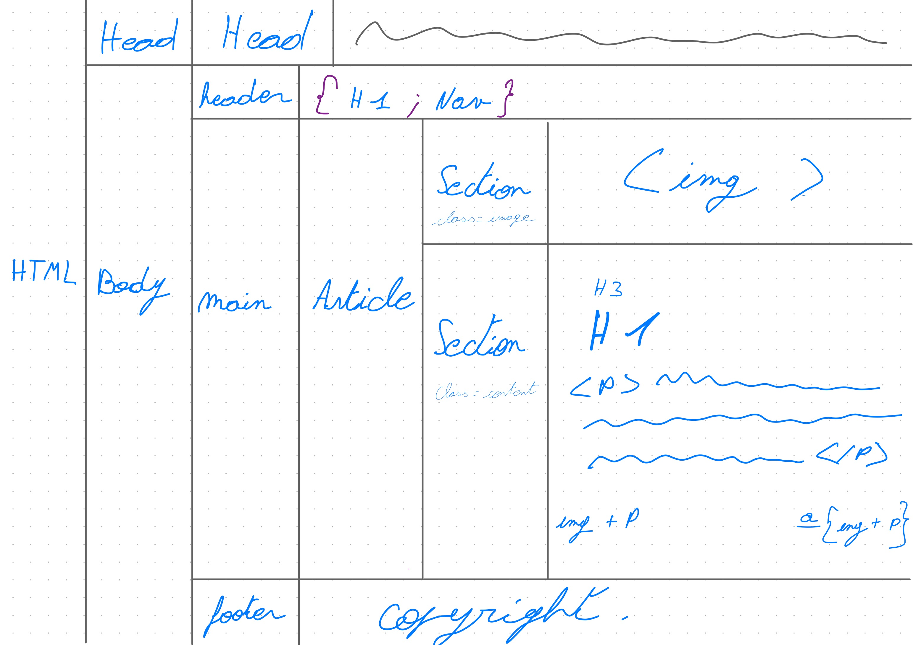

# TheCollection
## Display card from dom and style it with sass
### What should i actually do ?
* First create html and add the structure/the base (header,main,footer).
* Secondely create write the node structure on a sheet of paper to visualise ur nodes and where u will put ur card.
* Then create the table with the structure of ur card so something like : {[img ; attribue ; description]}.
* Lastly style it with scss.

### node structure

